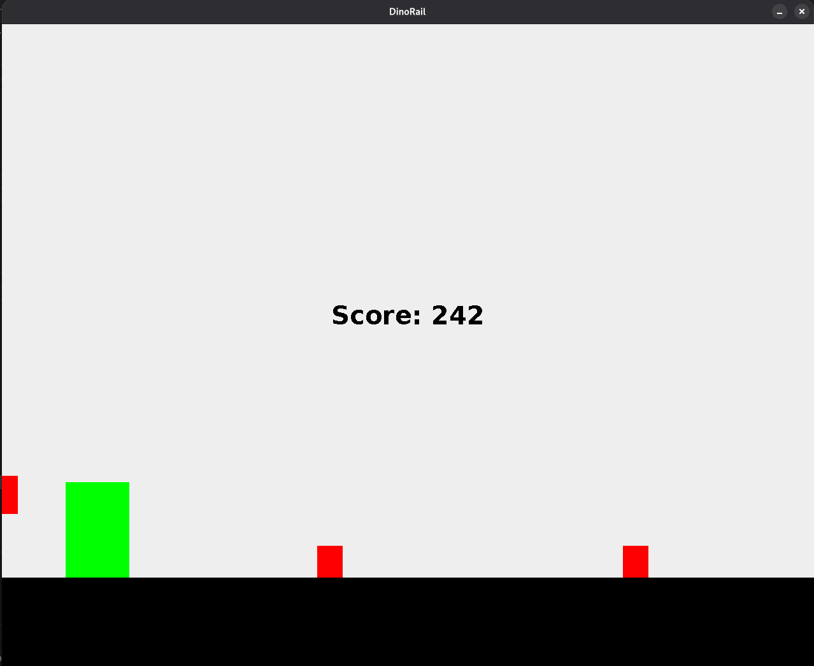

# DinoRail

## Objectif 🥅
Ce jeu est une reproduction du jeu chrome://dino.

Il existe des obstacles aériens et terrestre à éviter

## Comment jouer ? 🎢
Le joueur peut se mouvoir de 2 façons différentes:

- Sauter: 🕹️ vers le haut ou ⬆️
- S'abaisser: 🕹️ vers le bas ou ⬇️

## Contributeur
- DUFEUTREL Thibaut

## Contraintes 🚧
Le jeu devait pouvoir fonctionner sur l'architecture existante, soit un raspberry pi.

Le nom de la matière étant **Maintenance**, je me suis efforcé de concevoir un nouveau jeu en me basant sur les jeux déjà présents dans la borne

## Problèmes rencontrés ⚒️
- Animations non fonctionnelles: le délai entre les 2 frames est beaucoup trop court et l'utilisation de la classe Animation entraine de sérieux problèmes d'optimisation
- L'object **Texture**: cet objet extends de *java.awt.Rectangle* au lieu de *MG2D.geometrie.Rectangle*, ce qui implique que *Rectangle* n'implémente aucune méthode de *Dessin*
- Jouer des sons provoque des freezes (lors du saut du joueur par exemple)
## Amélioration 🔺

- Ajout de textures
- Ajout d'animations
- Mise à jour des scores dans le menu global de la borne